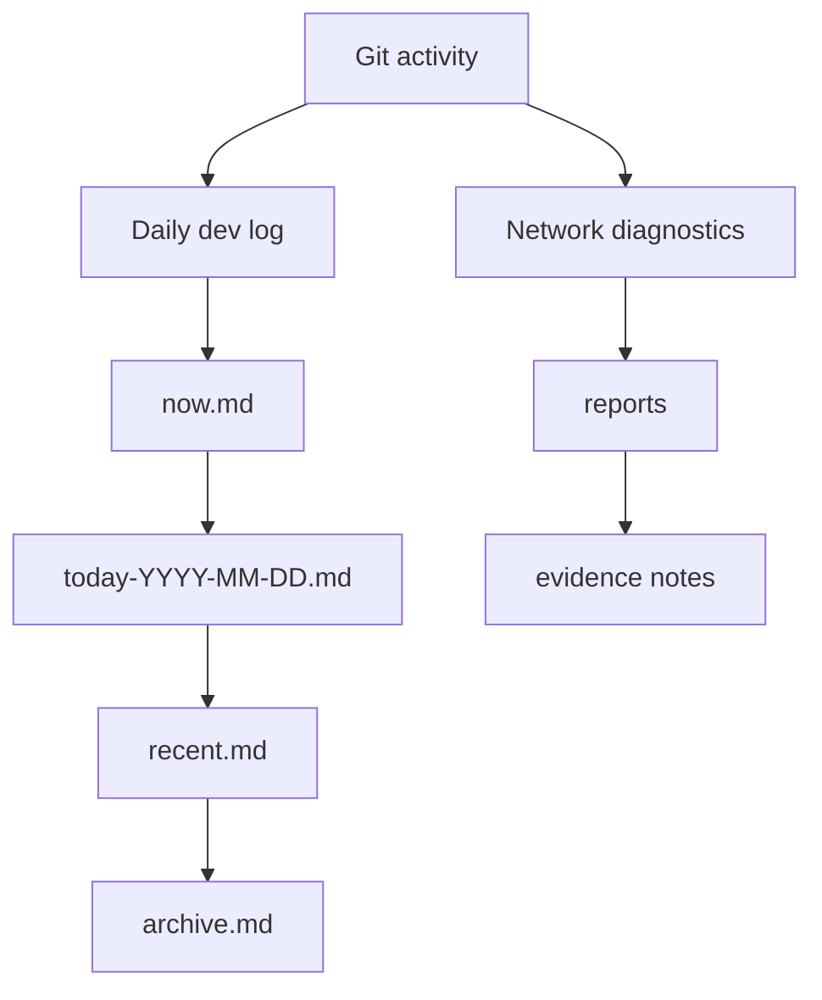

# OpenIA

## English

OpenIA is a Codex-first lab for practical AI workflows, daily dev logs, and evidence-driven network diagnostics.

It exists for one reason: turn everyday engineering work into something repeatable, observable, and easy to continue the next day.

### What stands out

- `daily-dev-log-skill` turns Git activity and working tree state into a real daily log.
- Network diagnostics scripts collect route, latency, and ISP evidence in a repeatable format.
- The workspace keeps long-running project context in plain files instead of hiding it in chat history.
- The repo is built around beginner-friendly automation: small commands, clear output, and no mystery state.

### Public highlights

- Public skill repo: [daily-dev-log-skill](https://github.com/warment/daily-dev-log-skill)
- Daily worklog pipeline: incremental capture, compression, consolidation, and handoff notes
- ISP diagnostics: router-aware reports and route analysis for provider troubleshooting

### How it is organized



### Why this repo exists

This project is a working notebook for real tasks, not a demo toy. It captures how to:

1. keep a daily record of progress without writing it by hand,
2. diagnose network problems with evidence instead of guesses,
3. build reusable Codex skills that can be shared with others.

## Русский

OpenIA — это практическая Codex-лаборатория для рабочих AI-процессов, дневника разработки и сетевой диагностики по доказательствам.

Здесь проект нужен для одного: сделать обычную инженерную работу повторяемой, наблюдаемой и удобной для продолжения на следующий день.

### Что здесь главное

- `daily-dev-log-skill` превращает действия в Git и состояние рабочей копии в настоящий дневник дня.
- Скрипты сетевой диагностики собирают маршрут, задержки и признаки проблем у провайдера в повторяемом формате.
- Контекст долгих задач хранится в обычных файлах, а не прячется только в истории чата.
- Проект построен так, чтобы было понятно начинающему: маленькие команды, ясный вывод, без скрытого состояния.

### Что уже есть публично

- Публичный навык: [daily-dev-log-skill](https://github.com/warment/daily-dev-log-skill)
- Дневник работы: инкрементальный сбор, сжатие, консолидация и заметка для передачи контекста
- Диагностика интернета: отчёты с учётом роутера и разбор маршрута до провайдера

### Как это устроено

```bash
git clone https://github.com/warment/openia.git
cd openia
```

### Зачем существует этот репозиторий

Это не демо-игрушка, а рабочий блокнот для реальных задач. Он показывает, как:

1. вести дневник прогресса без ручной записи,
2. диагностировать сеть по доказательствам, а не по ощущениям,
3. собирать повторно используемые навыки для Codex.

### Быстрый старт

```bash
git clone https://github.com/warment/openia.git
cd openia
```

Рабочая автоматизация лежит в отдельном публичном навыке:
[daily-dev-log-skill](https://github.com/warment/daily-dev-log-skill)

## Notes

This public repo is intentionally curated. It focuses on the showcase layer and avoids publishing local logs or machine-specific diagnostics.
