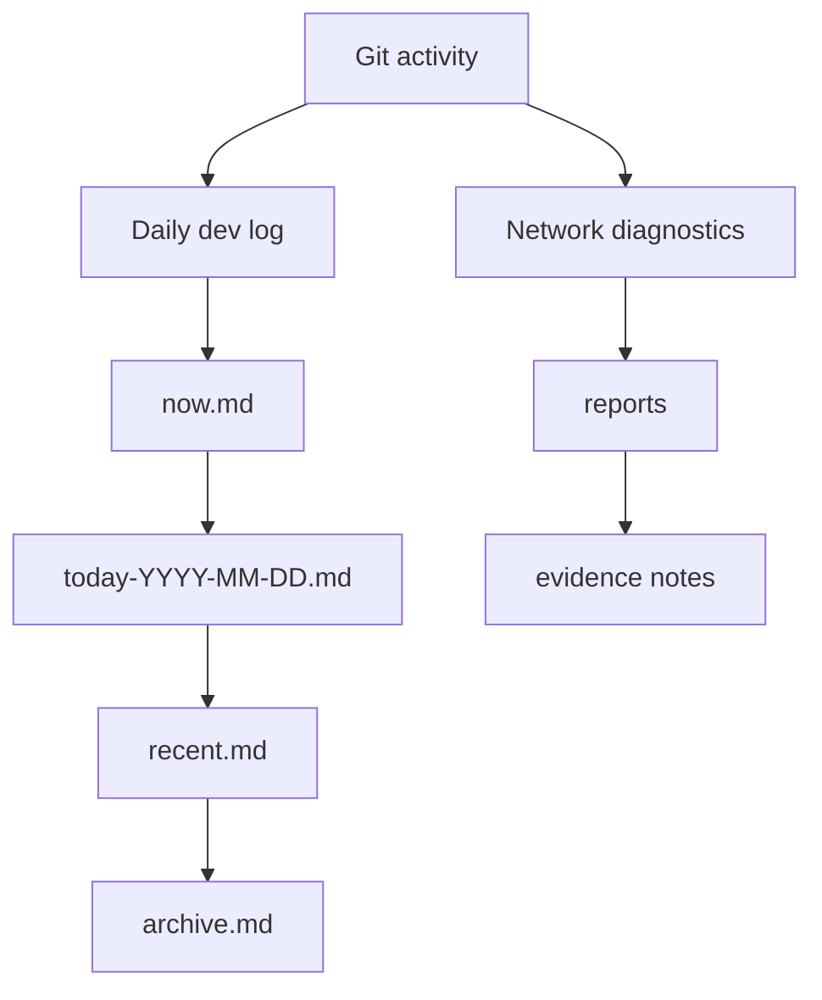

# OpenIA

OpenIA is a Codex-first lab for practical AI workflows, daily dev logs, and evidence-driven network diagnostics.

It exists for one reason: turn everyday engineering work into something repeatable, observable, and easy to continue the next day.

## What stands out

- `daily-dev-log-skill` turns Git activity and working tree state into a real daily log.
- Network diagnostics scripts collect route, latency, and ISP evidence in a repeatable format.
- The workspace keeps long-running project context in plain files instead of hiding it in chat history.
- The repo is built around beginner-friendly automation: small commands, clear output, and no mystery state.

## Public highlights

- Public skill repo: [daily-dev-log-skill](https://github.com/warment/daily-dev-log-skill)
- Daily worklog pipeline: incremental capture, compression, consolidation, and handoff notes
- ISP diagnostics: router-aware reports and route analysis for provider troubleshooting

## How it is organized



## Why this repo exists

This project is a working notebook for real tasks, not a demo toy. It captures how to:

1. keep a daily record of progress without writing it by hand,
2. diagnose network problems with evidence instead of guesses,
3. build reusable Codex skills that can be shared with others.

## Quick start

```bash
git clone https://github.com/warment/openia.git
cd openia
```

The runnable automation lives in the public skill repo:
[daily-dev-log-skill](https://github.com/warment/daily-dev-log-skill)

## Notes

This public repo is intentionally curated. It focuses on the showcase layer and avoids publishing local logs or machine-specific diagnostics.
